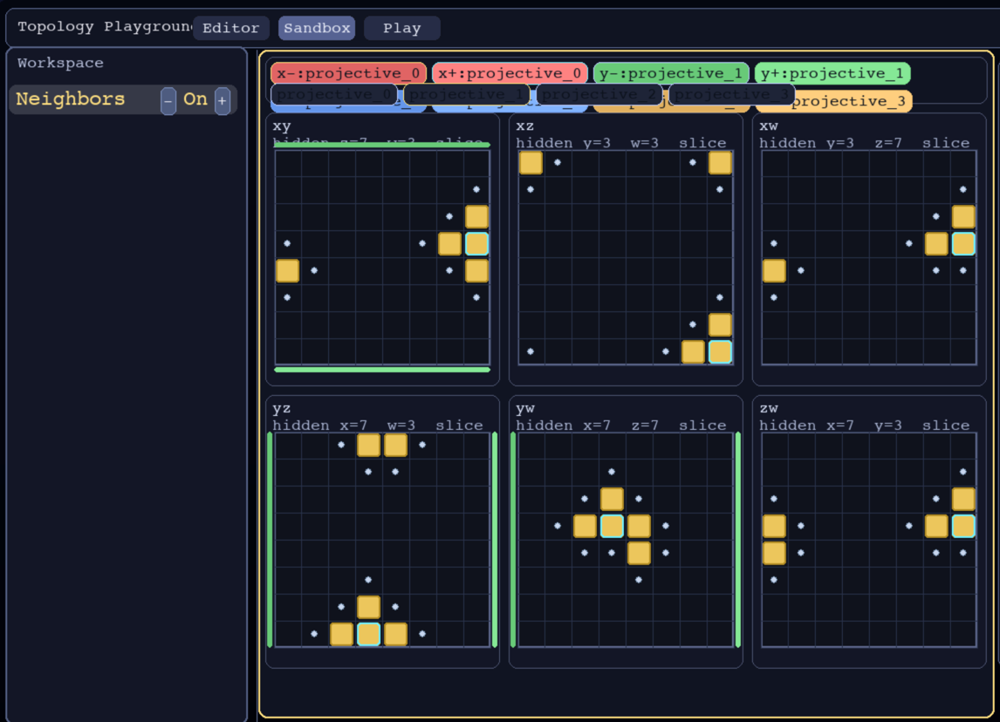
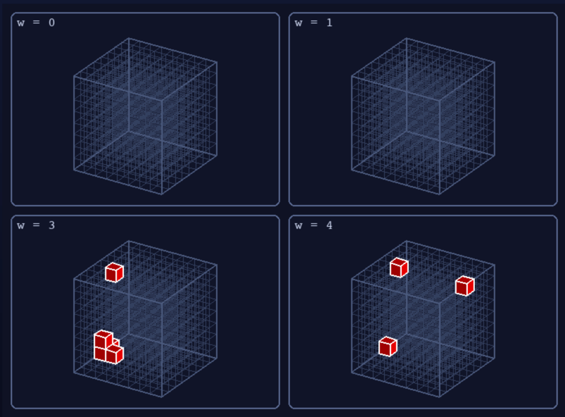

# tet4d

Usage guide for the 2D/3D/4D Tetris project.

## What this is

This is a 2D/3D/4D Tetris game written in Python. Currently, it contains a main launcher for the entire suite, dedicated 2D/3D/4D game launchers, Tutorials, and a Topology Explorer Playground, which is my main development effort right now.

4d game:


4d topology designer:



## Entry Points

`python front.py` — Root Wrapper, main launcher.

Use optional usage: front.py [--frontend {main,2d,3d,4d,front}]
to get directly to 2d/3d/4d game modes.

**Examples:**
```sh
python front.py                      # launches main unified launcher
python front.py --frontend 4d        # launches 4D mode directly
python front.py --mode 3d            # alias form
```

Use front.py --topology-playground [DIM]
to launch the Topology Playground directly.

```
  Examples:
  python cli/front.py                          # normal game launcher
  python cli/front.py --topology-playground    # topology playground, dim 2
  python cli/front.py --topology-playground 3  # topology playground, dim 3
  python cli/front.py --topology-playground 4  # topology playground, dim 4
```
 

Boundary topology presets are available in setup menus:
- `bounded` (default)
- `wrap_all`
- `invert_all`

Gravity-axis wrapping is disabled by default on Game Mode. Topology explorer, available through the topology playground, enables full wrapping including the Y axis.


Advanced topology designer controls are available per mode:
- `Topology advanced` (toggle)
- `Topology profile` (loaded from `config/topology/designer_presets.json`)

## Requirements

- Python `3.11+` (target compatibility includes `3.14`)
- Development, local verification, CI, and packaging all use the editable-install contract from `pyproject.toml`
- Do not install legacy `pygame` in the same environment
- CI validation matrix: Python `3.11`, `3.12`, `3.13`, `3.14`
- Desktop installers include embedded Python runtime (end users do not need system Python)

## Setup

Bootstrap script (preferred):

```bash
cd .
scripts/bootstrap_env.sh
source .venv/bin/activate
```

`scripts/bootstrap_env.sh` also installs the repo pre-push hook path
(`.githooks/pre-push`) so pushes run the local CI gate by default.

Manual setup uses the same editable-install contract:

```bash
python3 -m venv .venv
. .venv/bin/activate
python -m pip install -U pip
python -m pip install -e ".[dev]"
scripts/install_git_hooks.sh
```

`./scripts/verify.sh`, `./scripts/ci_check.sh`, and the GitHub workflows all assume the repo package is installed this way in the active environment.

## Development

- Canonical runtime source path is `src/tet4d/engine/`.
- `tet4d.engine.*` is the canonical import path for runtime/tests/tools.
- The repo expects an editable install for development and verification (`pip install -e ".[dev]"`).
- See `docs/MIGRATION_NOTES.md` for structure history and shim removal milestones.

## Run

```bash
# Unified launcher via compatibility wrapper (kept stable)
python front.py

# Unified wrapper selector (routes to main/2d/3d/4d; default is "main")
# `front` is an alias for `main` (same target)
python front.py --frontend 4d
python front.py --mode 2d

# Canonical direct entrypoints (primary scripts)
python cli/front.py

# Direct modes (canonical cli forms; root wrapper supports --frontend/--mode)
python cli/front2d.py
python cli/front3d.py
python cli/front4d.py
```

## Menu and tutorial controls

- Global menu navigation:
  - `Esc` / `Backspace`: go back (or exit current root menu)
  - `q`: normalized as menu-back / escape in menu flows
  - Tiny profile aliases: `i/k/j/l` -> up/down/left/right
- Tutorials are launched from the main launcher menu.
- Tutorial in-run hotkeys:
  - `F5`: previous stage
  - `F6`: next stage
  - `F7`: redo current stage
  - `F8`: exit tutorial to menu
  - `F9`: restart tutorial lesson

## Local desktop packaging (installer outputs)

```bash
# macOS (.dmg)
bash packaging/scripts/build_macos.sh

# Linux (.deb)
bash packaging/scripts/build_linux.sh
```

Windows (PowerShell, `.msi`):

```powershell
./packaging/scripts/build_windows.ps1
```

Build artifacts are written to `artifacts/installers/`.
The Windows build produces a self-contained `.msi` with the payload cabinet
embedded, so install does not depend on a sibling `cab1.cab` file.
Tag pushes matching `v*` also publish the generated installers through `.github/workflows/release-packaging.yml`.

## Key files

Menu config:
- `config/menu/structure.json`
- `config/menu/defaults.json`
- `config/help/topics.json`
- `config/help/action_map.json`
- `config/topology/designer_presets.json`

Runtime tuning:
- `config/gameplay/tuning.json`
- `config/gameplay/score_analyzer.json`
- `config/playbot/policy.json`
- `config/audio/sfx.json`

Project-wide path/constants/security policy:
- `config/project/io_paths.json`
- `config/project/constants.json`
- `config/project/policy/manifests/secret_scan.json`

User state:
- `state/menu_settings.json`
- `state/topology/selected_profile.json` (advanced topology export)
- `state/analytics/leaderboard.json`
- `state/tutorial/progress.json`
- `state/analytics/score_events.jsonl`
- `state/analytics/score_summary.json`

Keybindings:
- `config/keybindings/defaults.json`
- `keybindings/2d.json`
- `keybindings/3d.json`
- `keybindings/4d.json`

Control/action icon renderer:
- `src/tet4d/ui/pygame/render/control_icons.py`
- `draw_action_icon`

## Quality checks

```bash
ruff check .
ruff check --select C901 .
./scripts/check_editable_install.sh
python3 tools/governance/validate_project_contracts.py
python3 tools/governance/scan_secrets.py
python3 tools/governance/check_pygame_ce.py
pytest -q
PYTHONPATH=. python3 tools/stability/check_playbot_stability.py --repeats 20 --seed-base 0
python3 tools/benchmarks/bench_playbot.py --assert --record-trend
scripts/ci_check.sh

# Local quick parity run (quiet by default)
CODEX_MODE=1 ./scripts/verify.sh
```

## Documentation map

1. Project structure and documentation:
- `docs/PROJECT_STRUCTURE.md`
- `docs/FEATURE_MAP.md`
- `docs/CONFIGURATION_REFERENCE.md`
- `docs/USER_SETTINGS_REFERENCE.md`
- `docs/GUIDELINES_RESEARCH.md`
- `docs/RELEASE_INSTALLERS.md`

2. Usage:
- `README.md`

3. RDS and Codex guidance:
- `docs/RDS_AND_CODEX.md`
- `docs/rds/`

## Canonical maintenance

- Contract source: `config/project/policy/manifests/canonical_maintenance.json`
- Validator: `tools/governance/validate_project_contracts.py`
- Generated config references: `docs/CONFIGURATION_REFERENCE.md` and `docs/USER_SETTINGS_REFERENCE.md` (`tools/governance/generate_configuration_reference.py`)
- Secret scanning policy/runtime scanner: `config/project/policy/manifests/secret_scan.json` + `tools/governance/scan_secrets.py`

## Local pytest warning

- If you install `pytest` from local/offline wheels only, import can fail with `ModuleNotFoundError: No module named 'py'`.
- Workaround (offline/local wheel path): copy Homebrew shim file into the venv:
  - `cp /opt/homebrew/lib/python3.11/site-packages/py.py .venv/lib/python3.14/site-packages/py.py`
- Preferred path (when network is available): install `pytest` from PyPI into the active `.venv`.

## Test run TODO (short checklist)

1. Activate `.venv` and verify `pygame-ce` (not legacy `pygame`).
2. Ensure `ruff` and `pytest` import in `.venv`.
3. Run `scripts/ci_check.sh`.
4. If it fails, run the individual checks listed in `Quality checks` to isolate the failing stage.
