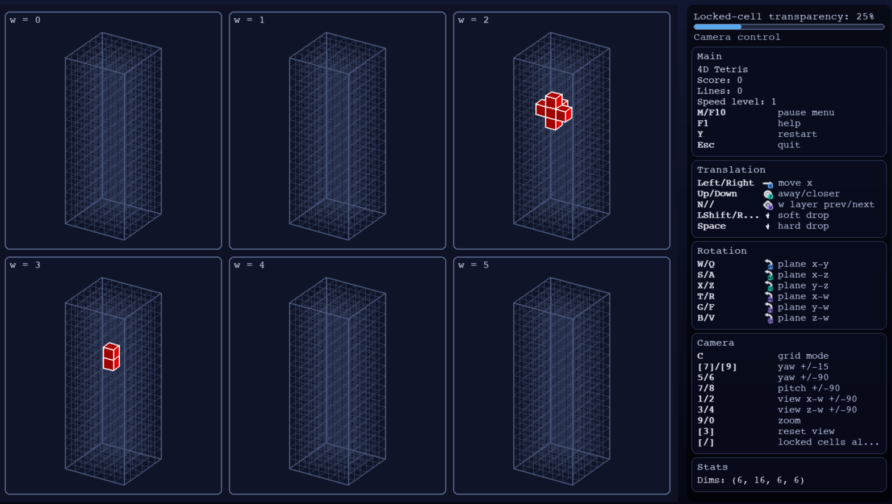

# Tet4D

Tet4D is a playable 2D/3D/4D Tetris-like project about learning to think spatially beyond ordinary 3D intuition.

The current professional-core product is the **Godot 4.7.2 game**: polished
bounded 2D, 3D, and 4D live play with NEXT, Ghost, Hold, replay, setup,
settings, display, and accessibility infrastructure.

The **Python/pygame implementation** remains reference authority for inherited
semantics that have not been transferred, and it retains topology, sandbox,
and simulation tools not yet integrated into the Godot product. It is not the
current professional-core release shell.



## What Tet4D Is

Tet4D began as a higher-dimensional Tetris experiment: falling pieces, slices, rotations, projections, and the attempt
to make four-dimensional structure playable rather than merely diagrammed. It now has three connected parts:

- **Game:** the Godot bounded 2D/3D/4D professional-core product.
- **Structure explorer:** topology and sandbox tools for inspecting how spaces connect and transform.
- **Reference and simulation tools:** Python-owned inherited semantics,
  topology experiments, and higher-dimensional simulation work.

## Python Reference / Legacy Tools

From the repo root:

```bash
scripts/bootstrap_env.sh
source .venv/bin/activate
python front.py
```

Or launch a specific Python frontend:

```bash
python front.py --frontend 2d
python front.py --frontend 3d
python front.py --frontend 4d
python cli/front.py --topology-playground
python cli/front.py --topology-playground 4
```

## What You Can Do in Python

- `front.py` launches the full game and project tools.
- `--frontend 2d`, `--frontend 3d`, and `--frontend 4d` open the playable Python front ends.
- `cli/front.py --topology-playground` opens the Topology Playground, which remains in Python.
- `cli/front.py --topology-playground 4` opens the 4D topology playground path.

## Godot Product Quick Start

From the repo root:

```bash
./scripts/build_godot_tet4d_core.sh
godot --path godot/Tet4D.Godot
```

Godot provides:

- `Replay Demos` under `Advanced / Diagnostics` for exported gameplay,
  topology, and endgame traces
- `Live Plain 2D`
- `Live Plain 3D`
- `Live Plain 4D`

Godot does not currently host the Topology Playground. That remains a Python
reference/tooling path outside the professional-core release gate.

Build the current macOS 13+ Universal release candidate with the exact pinned
Godot 4.7.2 editor and matching export templates:

```bash
GODOT_BIN=/path/to/Godot packaging/godot/build_macos.sh
```

See `docs/RELEASE_INSTALLERS.md` for the supported target, artifact checks,
outside-tree smoke procedure, and legacy packaging disposition.

## Why This Exists

Tet4D is motivated by a philosophical question:

**Is ordinary 3D spatial intuition a fixed ceiling, or a trained habit?**

A strong Kantian reading treats Euclidean 3D space as a necessary form of human spatial experience: higher dimensions
can be calculated, projected, and reasoned about, but not truly inhabited by intuition.

Thomas Reid points in the opposite direction. His “geometry of visibles” suggests that practical spatial understanding
is not simply read off the eye. It is stabilized through vision, touch, movement, correction, and repeated action in
the world.

Tet4D turns that question into an artifact. If spatial intuition is trained by action, then a structured 4D world is
not only something to visualize. It is something a player might gradually learn to move inside.

For the longer philosophical background, see
[docs/philosophy/PHILOSOPHY.md](docs/philosophy/PHILOSOPHY.md).

## Setup

Preferred bootstrap:

```bash
scripts/bootstrap_env.sh
source .venv/bin/activate
```

Manual setup:

```bash
python3 -m venv .venv
. .venv/bin/activate
python -m pip install -U pip
python -m pip install -e ".[dev]"
scripts/install_git_hooks.sh
```

## Run Commands

Python launcher:

```bash
python front.py
python front.py --frontend 2d
python front.py --frontend 3d
python front.py --frontend 4d
python cli/front.py --topology-playground
python cli/front.py --topology-playground 4
```

Godot front end:

```bash
./scripts/build_godot_tet4d_core.sh
godot --path godot/Tet4D.Godot
```

Godot tests:

```bash
godot --headless --path godot/Tet4D.Godot --script tests/run_tests.gd
```

Native core build and parity tests:

```bash
./scripts/test_godot_tet4d_core.sh
native/tet4d_core/build/tests/geometry_core_tests --geometry-parity
native/tet4d_core/build/tests/query_core_tests --query-parity
```

Python-golden gameplay parity checks:

```bash
.venv/bin/python tools/migration/compare_cpp_gameplay_trace.py --all-plain-2d
.venv/bin/python tools/migration/compare_cpp_gameplay_trace.py --all-plain-nd
```

Primary verification gate:

```bash
CODEX_MODE=1 ./scripts/verify.sh
```

## Known Limitations

- Python remains reference authority for inherited, untransferred semantics;
  authority is subsystem-specific rather than language-global.
- Godot is the current bounded 2D/3D/4D professional-core product shell.
- Native C++ powers accepted live sessions plus geometry/query helpers and
  owns authoritative Hold under `AE-0055`.
- Topology Playground, broader topology editing, and Python-first development flows still live in the Python launcher.
- The current supported release target is a macOS 13+ Universal Godot app/ZIP.
  Linux and Windows Godot artifacts are development-configured but not
  runtime-accepted release targets. The old PyInstaller installers are retained
  legacy packaging.

## More Docs

- Documentation map:
  - `docs/CONFIGURATION_REFERENCE.md`
  - `docs/USER_SETTINGS_REFERENCE.md`
  - `docs/RELEASE_INSTALLERS.md`
- Godot shell notes: `godot/Tet4D.Godot/README.md`
- Philosophy and motivation: `docs/philosophy/PHILOSOPHY.md`
- Workflow and contributor rules: `docs/WORKFLOW_CODEX.md`
- Product requirements: `docs/rds/`
- Current open work: `docs/BACKLOG.md`

## Developer References

- Packaging:
  - `packaging/godot/build_macos.sh`
- Verification:
  - `scripts/ci_check.sh`
  - `tools/governance/scan_secrets.py`
  - `tools/governance/check_pygame_ce.py`
- Runtime config:
  - `config/gameplay/score_analyzer.json`
  - `config/project/io_paths.json`
  - `config/project/constants.json`
  - `config/project/policy/manifests/secret_scan.json`
