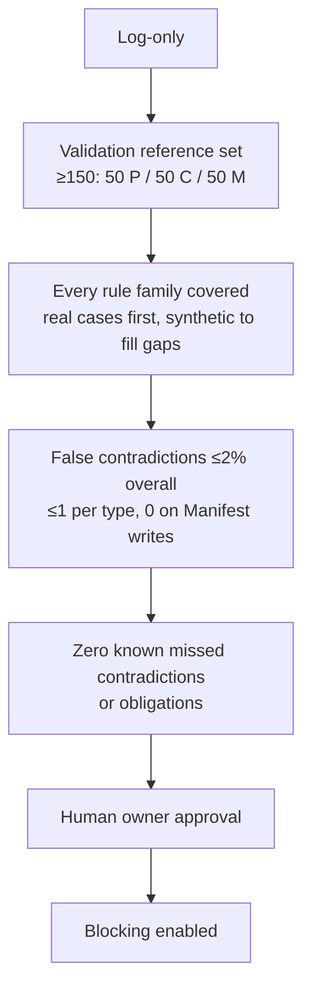

# Three-type work classification

Status: accepted architecture decision (2026-09-19). This record is rollout
step 1; the remaining steps are open work in `docs/BACKLOG.md`.

**Decision in one line:** every substantive **work segment** is exactly one of
**Planning**, **Coding** or **Manifest**, defined by the kind of work, not its
subject. A separate, explicitly declared artifact-role layer decides which
verification evidence is required. Writes attributable to a segment can
disprove the type declared for it.

## Context

Governance already sorts work along two axes. Neither one says what kind of
work is being performed.

| Axis | Values | Controls | Defined in |
| --- | --- | --- | --- |
| Execution mode | `LOCAL_FIX`, `FEATURE`, `STRUCTURAL_CHANGE` | How much exploring is done | `config/governance/project.json#/execution` |
| Route | `godot_product_shell`, `governance_and_tooling`, `python_reference_engine`, 4 more | Which domain, and its authorities | `config/governance/project.json#/routes` |

That gap creates two problems.

- **Measurement.** The governance-manifest quality experiment asks how the
  governance treatment affects coding work. Tet4D does a lot of governance
  development. If that work is sorted by subject ("product" vs. "meta"),
  ordinary engineering like resolvers, validators and experiment harnesses gets
  pooled with edits to the treatment itself, which skews the result. Commit
  `779f1381 feat(experiments)` is an example: about 2,900 lines of Python and
  tests that are Coding, even though they're about governance.
- **Enforcement.** Nothing ties a claimed kind of work to what was actually
  written. And nothing stops a change from weakening the governance rules that
  judge it.

## Decision

### 1. Semantic work ontology

Every substantive work segment is exactly one of three types. The type answers
"what kind of work is being done right now?", never "what subsystem is it
about?".

| Type | Definition | Examples |
| --- | --- | --- |
| Planning | Understanding, evaluating, designing, reviewing or deciding, without making the resulting change | Architecture design, experiment design, investigation before a decision, code review for evaluation, analysis of results |
| Coding | Implementation whose target is behavior that runs or is interpreted mechanically | Features, fixes, refactors, tests, debugging during implementation, validators, resolvers, experiment harnesses, measurement tools, schemas |
| Manifest | Directly changing the governance treatment: the instruction and control surface that governs the agent | Route and scenario declarations, priorities, thresholds, normative governance text, agent instruction files |

- **Meta is not a type.** Work about governance or experiments takes the type
  of what is actually being done.
- **Machinery vs. treatment.** Changing machinery that interprets governance is
  Coding. Changing the governance treatment is Manifest. This is decided by
  meaning, not by directory: in the vendored pack,
  `tools/workspace_governance/resolver/` and `schemas/` are Coding, while
  declarative treatment text such as `policies/ownership.md` is Manifest.
- **Verification takes the type of the work it verifies.** Running tests during
  implementation is Coding. Checking the manifest after a treatment edit is
  Manifest.
- **Documentation is typed by what it does.** Docs that complete an
  implementation are Coding. Design written to decide future work is Planning.
  Changes to normative governance text are Manifest.

### 2. Segment model

- A work session is a sequence of segments, for example Planning → Coding →
  Manifest → Coding. There is no `MIXED`, `META` or `VERIFICATION` type.
- Segments are coarse phases of work. Debugging inside implementation stays
  Coding, so they don't split on every diagnostic step.
- Planning exists without a diff. An investigation that concludes "do nothing"
  is still Planning.
- Administrative steps (git operations, activating an environment, bookkeeping
  for transcripts) carry a `non_work` flag. They keep the type of the
  surrounding segment and are left out of workload measurements.

### 3. Artifact roles and the Manifest surface

Route membership, dispatch membership, authority membership and artifact role
are independent relationships. Routing says which context an agent should
receive for a task. Artifact role says what that context **is**. In particular:

> **Routing membership does not imply Manifest membership.** `dispatch_paths`
> is routing/context metadata only. It MUST NOT be used to infer artifact role,
> work type or membership in the Manifest surface.

The artifact layer uses explicit semantic roles. The generic vocabulary lands
in the workspace-governance pack; project and pack declarations assign roles
to concrete artifacts.

| Artifact role | Meaning | Examples |
| --- | --- | --- |
| `governance_treatment` | Instruction or control surface that governs the agent | Root and nested agent instructions, canonical governance owners, declarative pack policy |
| `executable_machinery` | Mechanically interpreted implementation | Resolvers, validators, schemas, experiment and enforcement code |
| `product_authority` | Product or architecture truth | RDS, architecture contracts and subsystem authorities |
| `planning_document` | Design or investigation used to decide future work | Plans, proposals and non-authoritative experiment protocols |
| `generated` | Output owned by a generator or synchronization process | Lock records and generated references |
| `bookkeeping` | Operational state required alongside other work | Backlog and bounded handoff records |

After the role migration, the Manifest surface is exactly the artifacts declared
as `governance_treatment`; semantic role metadata is canonical and inference
from routing is prohibited. `canonical_governance: true` remains useful as an
authority property and as bootstrap evidence, but it does not carry every
artifact-role distinction.

The initial migration is seeded from existing authority rather than from
`dispatch_paths`:

| Bootstrap source | Initial role consequence |
| --- | --- |
| `config/governance/project.json` | `governance_treatment` and immutable bootstrap root |
| Six authorities with `canonical_governance: true` | Seed their source artifacts as `governance_treatment` |
| Root and nested `AGENTS.md` plus root `CLAUDE.md` | Seed known agent instruction/control surfaces as `governance_treatment` |
| `config/project/policy_pack.json` | `governance_treatment` while it remains the compatibility authority |
| Workspace-governance pack role metadata | Declare treatment such as `policies/ownership.md` as `governance_treatment` and resolvers and schemas as `executable_machinery` |

The compatibility policy already registers root `AGENTS.md` and `CLAUDE.md` as
active governance. What is missing is their declaration under the new generic
artifact-role schema, not their current governance registration. A
relevant artifact lacking a role after migration remains explicit uncertainty
in log-only mode and fails closed once blocking is enabled; the classifier never
guesses from its extension, directory or route.

**Semantic-authority transition.** Before step 4, the bootstrap sources above
provide a temporary projection for design and historical analysis. Step 4 is
the explicit handoff of artifact-classification authority to project and pack
role declarations. The handoff is not complete until every bootstrap artifact
and every artifact in the mechanically defined universe the classifier must
classify has an explicit role, route-resolution equivalence passes, and the
human owner accepts the migration. This requires complete relevant coverage,
not declarations for arbitrary repository files. After that transition, role
declarations are the sole semantic owner: the bootstrap projection and
`canonical_governance` remain provenance/evidence, and neither they nor
`dispatch_paths` are fallback classifiers. This planning record does not
perform the handoff itself.

Product and design authorities (`docs/architecture/`, `docs/rds/`,
`docs/plans/`, `docs/ARCHITECTURE_CONTRACT.md`) are **not** Manifest merely
because they are normative or dispatched. Editing them is Planning or Coding.
The artifact layer still imposes their authority-update obligations. Existing
route resolution and `dispatch_paths` behavior remain unchanged by the role
migration.

### 4. Enforcement layer

Paths don't define intent, but **writes attributable to a segment can disprove
the type declared for it**. Only writes count. Reads, searches, test runs and
inspections never contradict a type, and neither does the final diff of the
whole session.

The final diff and each attributable segment write are resolved to an artifact
role. During bootstrap, the temporary projection in section 3 supplies that
role. After the semantic-authority handoff, explicit role declarations are
authoritative and inference from routing, extension, directory or path prefix
is prohibited. Mechanical enforcement consumes the resolved role; it does not
manufacture the role's semantics. Each attributable write is then checked
against the compatibility table below, which has three possible results.

| Work type | `executable_machinery` | `governance_treatment` | `product_authority` | `planning_document` | `generated` | `bookkeeping` |
| --- | --- | --- | --- | --- | --- | --- |
| Planning | Contradiction | Contradiction | Allowed | Allowed | Contradiction unless justified | Allowed if subordinate |
| Coding | Allowed | Contradiction | Allowed + authority obligations | Allowed if subordinate to the implementation | Allowed through its owning generator | Allowed |
| Manifest | Contradiction | Allowed | Contradiction unless justified | Allowed only when documenting the Manifest decision | Allowed through its owning generator | Allowed |

- **Allowed** doesn't mean "no extra checks." Every artifact role changed still
  adds its own evidence obligations, and the required evidence is their union.
- **Contradiction unless justified** and **if subordinate** are conditional. The
  write is logged with its justification and the independent labeler reviews
  it; it's never silently passed.
- **Classifier requirement.** The artifact classifier consumes declared
  artifact roles. It must resolve exactly `governance_treatment`,
  `executable_machinery`, `product_authority`, `planning_document`, `generated`
  and `bookkeeping` without deriving meaning from file extensions, directories,
  route membership or `dispatch_paths`.
- Bookkeeping that `CHANGE_GOVERNANCE.md` requires alongside code adds its own
  obligations and changes nothing else.

| Setting | Missing required gate | Write contradicts declared segment type |
| --- | --- | --- |
| Live work, first rollout | Block (as today) | Log only, while the false-contradiction rate is measured |
| Live work, after that | Block | Block, once the log-only exit criteria (Rollout) pass |
| Historical classification | Record | Record as mismatch or uncertainty metadata; never relabel to hide it |

### 5. No self-relaxation

A Manifest change must not be the only judge of itself. This rule is a
**mechanical non-weakening test**, not a complete semantic proof. Changes it
can't settle go to a human.

1. **Scope.** The rule applies to any change touching the union of the **base**
   Manifest surface, the **candidate** Manifest surface, and the immutable
   bootstrap roots. The union means a candidate can't hide its own edit by
   dropping a file from the surface.
2. **Directional descriptors.** Compute a normalized obligation descriptor
   under both treatments. The schema declares a comparator for every field
   according to what the field means, never its datatype (table below), so
   "unchanged or stronger" has a mechanical meaning. A set of routes may be
   all-required or any-of, and the two strengthen in opposite directions. The
   same name alone is never enough.
3. **Three outcomes.** A field is *preserved*, *weakened* or *indeterminate*.
   Indeterminate never counts as a pass. If every field of every old obligation
   is preserved, the change proceeds with the union of obligations from both
   treatments. Anything weakened, removed or indeterminate (including fields
   the normalizer doesn't recognize) goes to the human owner before merge. An
   agent may produce the comparison but may never approve it.

| Normalized field meaning | Comparator | Preserved when |
| --- | --- | --- |
| `required_all_of` (every member must run) | `set_superset` | The candidate set contains the base set |
| `allowed_any_of` (any member satisfies it) | `set_subset` | The candidate set is contained in the base set |
| `trigger_coverage` (paths that trigger the obligation) | `set_superset` | The candidate set contains the base set |
| `forbidden_set` | `set_superset` | The candidate set contains the base set |
| `permitted_set` | `set_subset` | The candidate set is contained in the base set |
| `exact_set` | `equality` | Identical |
| Minimum coverage or similar floors | `numeric_gte` | Candidate ≥ base |
| Maximum size or similar ceilings | `numeric_lte` | Candidate ≤ base |
| Required boolean | `false_to_true_only` | Unchanged, or false → true |
| Exact identity (versions, hashes) | `equality` | Identical |
| Unknown or no natural direction | `human_review` | Always indeterminate |

The base treatment only computes obligations and never validates the candidate
manifest, so a new key landing with the code that reads it doesn't trip the
check.

**Bootstrap roots** include `config/governance/project.json`, the declaration of
the surface itself, and the **enforcement machinery**: the classifier and the
obligation comparison. Enforcement code is Coding work, but a change to it is
still evaluated by the **base** version of that code. Otherwise a Coding change
could weaken the check that governs Manifest changes.

**Where the root set comes from.** The workspace-governance pack at the **base**
revision, together with its enforcement implementation, owns which paths count
as bootstrap roots. The candidate project treatment being evaluated can't
redefine them. Otherwise a candidate could drop the checker from the root
declaration before the comparison runs. Changing the root set itself needs a
pack release, which is judged by the base pack under this same rule.

### 6. Relation to route and execution mode

Work type, execution mode and route are **independent axes**:
`work_type: Manifest`, `mode: STRUCTURAL_CHANGE`,
`route: governance_and_tooling` is one point, not a single definition.
Correlations such as Manifest tending to be structural are measured, not built
in. Keeping the axes independent is also what lets the experiment measure the
effect of mode within each type. Artifact role is a separate artifact-level
classification: one file can have packaging route membership and
`product_authority` role without conflict.

## Experimental use

Each type is a separate population, and none is pooled with another.

| Type | Role | Question it answers |
| --- | --- | --- |
| Coding | Main population measured | How does the treatment affect correctness, efficiency, scope discipline and architectural quality of coding? |
| Planning | Secondary population, analyzed separately | Does the treatment improve decisions, and at what retrieval cost? |
| Manifest | Population for maintaining the treatment | What does the governance system cost to maintain and change? |

**Task-level guard metric.** Coding is still the main population, but splitting
by type can hide effort that has just moved elsewhere. Every experimental task
also reports a total across its Planning and Coding segments:

- tokens, elapsed time and tool calls
- retrieval and materialization
- failures and retries
- the final engineering outcome
- scope and authority violations

| Treatment B vs. A | Planning cost | Coding cost | Coding-only reading | Task total |
| --- | --- | --- | --- | --- |
| Displacement example | +100 | −80 | "B is more efficient" | +20: B costs more |

A Coding improvement counts only if the task total doesn't contradict it.

**Frozen treatment.** In controlled coding experiments the treatment is frozen,
so Manifest writes are forbidden by protocol. If one happens, it's reported as a
protocol event and the task is flagged. Its cost never counts toward the Coding
numbers.

### G1 log-only observer contract

The first live instrument is deliberately smaller than the eventual enforcement
layer. `tools/governance/observe_work_segment.py` records one declared segment
from two repository-content snapshots. Its machine-readable result contains the
segment boundaries, files written, change kinds, resolved artifact roles and
their provenance, observational compatibility, and bounded telemetry supplied
by the caller. A contradiction is data: it never changes the command's success
status.

Role resolution is exact and provenance-preserving. Project and pack role
declarations resolve as `explicit_declared`; the accepted bootstrap sources in
this decision resolve as `bootstrap_projected`; everything else resolves as
`unclassified`. Routes, `dispatch_paths`, directory names, extensions and
filename patterns are not role inputs. The bootstrap is observation machinery,
not a semantic authority handoff, and its output records are non-authoritative.

G1 does not implement the base/candidate non-self-relaxation comparison. That
comparison needs two runnable treatments and immutable-root union semantics, so
it remains a separate bounded Coding change if real observer evidence justifies
it. G1 also introduces no committed log corpus, blocking, role migration,
independent classifier or threshold calibration.

## Historical classification and segmentation reliability

The main measurement depends on segment labels, so how segments get labeled is
the experiment's biggest risk.

- **Boundaries and labels are separate.** The agent declares segment boundaries
  and tentative types during the session. That makes write attribution and the
  mechanical contradiction check possible. These declarations are **telemetry,
  not ground truth**.
- **Independent analytical labels.** An independent classifier assigns the
  labels used in analysis after the session. This prevents a treatment leak: if
  treatment A made agents call more of their work Planning than treatment B,
  self-labels would bias the result. The labeler is kept blind to which
  treatment was assigned, except where the work itself reveals it. Manifest
  segments generally can't be blinded, because their subject is the treatment.
- **Disagreement is data.** Where the agent's declaration and the independent
  label differ, the difference is recorded and analyzed.
- **A new hand-labeled reference set.** It's built for work-phase segmentation
  and measures how often the classifier agrees. The C1 `semantic_cases.json`
  fixtures were built to validate trajectory accounting, so individual cases are
  reused only after being relabeled for this purpose.
- **Uncertain segments.** These stay labeled `uncertain`, a statement about
  label confidence, not a fourth type. They are left out of the primary C2
  estimate and included in a sensitivity analysis specified in advance.
- **Commits are not segments.** A commit flattens a session and hides the
  Planning → Coding → Manifest transitions this ADR recovers. So historical
  classification relies on transcripts, including web-chat sessions, if they
  can be exported and normalized with enough provenance. Commit messages are
  consistency metadata, never authority.

## Evidence

This is commit-level supporting evidence, not segment classification. It is a
retrospective projection of the bootstrap semantics of section 3 onto the fixed
historical baseline `be400527a2f3cb1401f0381540c279be355b50a6`, the tip of
master when this record was written. Fixing the baseline fixes the corpus: this
record's own introduction, and any later reconstruction of it, cannot change
the evidence it cites. Of the 222 non-merge commits from 2026-06-01 to that
baseline, 53 (about 24%) change code and the projected `governance_treatment`
surface together, and only 5 change that surface without code. One label per
commit is therefore too coarse, and a ban on mixed commits isn't workable.

| Projected artifact-role combination | Commits | What it shows |
| --- | --- | --- |
| Code + product/architecture authority, no Manifest | 78 | Authority and code edits often occur in the same commit |
| Code + Manifest surface (with or without docs) | 53 | Manifest and code changes often occur in the same commit |
| Code + other docs | 31 | Normal Coding with bookkeeping |
| Code only | 25 | |
| Other docs only | 21 | Planning or bookkeeping on its own |
| Authority (with or without docs), no code | 9 | Design written before implementation |
| Manifest surface, no code | 5 | Manifest-only changes are rare today |

The counts do not claim that explicit artifact roles existed at the time; they
project today's bootstrap set backwards. The rows are mutually exclusive and
together cover all 222 commits: a commit touching code and the projected
treatment surface counts in the Manifest row whatever else it changes. For this
tally the bootstrap projection is:

- **Projected `governance_treatment`** = `config/governance/project.json`, the
  six `canonical_governance` docs, root and nested `AGENTS.md`, root
  `CLAUDE.md`, `config/project/policy_pack.json`, and
  `tools/workspace_governance/policies/`.
- **Projected `product_authority`** = `docs/architecture/`, `docs/rds/`,
  `docs/plans/` and `docs/ARCHITECTURE_CONTRACT.md`.
- **Projected `planning_document` / `bookkeeping`** = the rest of `docs/`, plus
  `CURRENT_STATE.md` and `README`. The legacy tally pools these roles as "other
  docs" because path-only history cannot reliably distinguish them.
- **Projected `generated`** = `config/governance/workspace.lock.json`, the pack lock record
  that sync writes. It changes in 11 commits, and each of those also changes
  code, so the table rows are the same with or without this role.
- **Projected `executable_machinery`** = everything else.

This record is not in the corpus. It descends from the baseline rather than
sitting inside it, so accepting it leaves every count above unchanged.

The historical projection was assigned by path because the commits predate role
metadata. Declared artifact roles replace that bootstrap projection for live and
future classification once the migration lands. `dispatch_paths` contributes
nothing to either definition.

## Alternatives considered

The test used throughout: a work type exists only if it defines a **distinct
experimental population**. Evidence gates are not a reason to add a type,
because they belong to the artifact layer.

| Alternative | Verdict | Reason |
| --- | --- | --- |
| Product vs. meta | Rejected | Mixes up subject with kind of work; governance tooling is real Coding |
| Coding vs. everything else | Rejected | Collapses Planning and Manifest, which play different experimental roles |
| Add Verification, Mixed or Meta types | Rejected | Verification takes its parent's type; Mixed throws away time order; Meta is a subject, not a type |
| Add Authority/Spec or Records types | Rejected | Product authorities are Planning or Coding plus obligations; records are Planning or bookkeeping |
| Type = the paths the diff touches, with precedence Coding > Manifest > Planning | Rejected | Merges Manifest segments into Coding, which erases the signal the experiment needs; can't type Planning with no diff |
| Type by intent alone, with no checks | Rejected | Can't be enforced; attributable writes add a check that can disprove claims |
| Manifest = any normative text that affects agents | Rejected | Too broad; would take in product authorities. Use explicit `governance_treatment` role metadata, bootstrapped in part from `canonical_governance` |
| Manifest = `canonical_governance` + `dispatch_paths` | Rejected | Authority and routing membership are not artifact semantics; dispatched product authorities must not become treatment |
| Commit prefix decides the type | Rejected | Commit messages are metadata, not authority |
| Check the change only against the base treatment's manifest | Replaced by rule 5 | Fails when a new key and the code reading it land together; comparing obligations under both treatments avoids that |
| Manifest implies `STRUCTURAL_CHANGE`; Planning has no mode | Rejected | Axes must stay independent, or the effect of mode can't be measured |

## Consequences and risks

**Gains**

- Coding measurements are isolated from maintenance of the treatment, while
  governance tooling code stays in the Coding population.
- Planning becomes a population that can be measured, including work that
  leaves no diff.
- Enforcement is mechanical where it can be (attributable writes,
  artifact-role obligations, comparing obligations under base and new
  treatment) and human only where meaning is involved.
- The difference between declared and observed types becomes a calibration
  signal.

**Costs and risks**

- **Write attribution.** Segments need timestamped boundaries, and writes need
  linking to a segment. Edit and Write tool calls are easy to attribute; writes
  made from shell commands or generators need a filesystem snapshot at each
  segment boundary.
- **Segmentation reliability** is the main threat to validity (see Historical
  classification). It needs an independent labeler and a hand-labeled
  reference set before C2.
- **Upstream dependency.** `tools/workspace_governance/schemas/project.schema.json`
  sets `additionalProperties: false`, and
  `config/governance/workspace.lock.json` locks every pack file by content
  hash. The vocabulary, role metadata and comparator declarations therefore
  need an upstream workspace-governance release and a re-sync. They can't be
  edited locally.
- **Classifying artifacts.** Resolving `governance_treatment`,
  `executable_machinery`, `product_authority`, `planning_document`, `generated`
  and `bookkeeping` needs declared role metadata. Until the migration exists,
  unclassified writes log as uncertain.
- **Artifact-role migration.** Root `AGENTS.md` and `CLAUDE.md` are registered
  in the compatibility governance surface today, but they and the other
  bootstrap artifacts lack declarations under the new generic role schema.
  The migration must declare those roles without changing route resolution.
- **Comparing across pack versions.** Rule 5 needs the base and candidate pack
  runnable side by side, for example in a worktree at the base revision.

## Rollout

The rollout follows the ontology it defines. No mechanism is asked to certify
its own introduction.

1. **Planning:** accept this ADR and land it under `docs/architecture/`.
2. **Coding (upstream):** extend the workspace-governance pack with the
   work-type vocabulary and generic artifact-role schema in `project.schema.json`,
   pack-owned role metadata separating machinery from treatment (for example
   `resolver/core.py` and `schemas/` are `executable_machinery`, while
   `policies/ownership.md` is `governance_treatment`), and comparator
   declarations for obligation descriptors. Release it, then bump and re-sync
   the vendored copy. Tet4D keeps no separate hand-made list of pack roles.
3. **Coding:** build segment declaration, write attribution, the artifact
   classifier against declared roles, and the obligation comparison. They run
   in **log-only** mode. The classifier is forbidden to infer role from
   `dispatch_paths`.
4. **Manifest migration:** declare all six Tet4D artifact roles:
   `governance_treatment`, `executable_machinery`, `product_authority`,
   `planning_document`, `generated` and `bookkeeping`. This includes the six
   canonical governance owners, root and nested instruction surfaces, product
   authorities, planning documents, generated artifacts and bookkeeping.
   Prove that route resolution and dispatched context are unchanged while the
   new semantic declarations classify the artifacts correctly. This initial
   migration covers the complete mechanically defined classifier universe and
   gets **explicit human review**: the base revision had no non-weakening check,
   so the comparison can inform the review but can't certify it.
5. **Planning + human labeling:** build the stratified validation reference set
   (see exit criteria) from real historical cases first, pre-register the
   minimum number of positive cases per rule family, fill any shortfall with
   synthetic cases, and only then evaluate the detector and calibrate the
   independent classifier.
6. **Manifest:** enable blocking as a separate change only after the log-only
   observation and exit criteria below pass.

### Bootstrap path

| Mechanism | Introduced in step | Certified at introduction by | Self-certification? |
| --- | --- | --- | --- |
| The ontology itself | 1 | Human owner accepting the ADR | No |
| Pack schema, role metadata, comparators | 2 | Upstream pack tests and the existing Tet4D gates, plus owner review; there is no base comparator yet | No |
| Classifier, attribution, comparison | 3 | Existing Tet4D gates plus owner review; the rule that enforcement code is judged by its base version has nothing to compare against at introduction | No |
| Artifact-role migration | 4 | Human review plus route-resolution equivalence, informed by the step-3 comparison | No |
| Independent labeler | 5 | The human-labeled reference set | No |
| Blocking | 6 | Exit criteria plus owner approval. The rule-5 comparison runs too: turning blocking on reads false → true, which it can show is stronger | No |

Every step after its introduction is covered by the mechanisms introduced
before it. Future pack bumps go through rule 5 with the base pack run side by
side.

### Exit criteria for log-only mode

Blocking on type contradictions may be enabled only when a **validation
reference set** passes. It is deliberately built evidence of readiness to
enforce, not a random sample of ordinary work.

- **Size and stratification.** At least 150 substantive segments, independently
  reviewed: at least 50 Planning, 50 Coding and 50 Manifest. Strata are filled
  deliberately, not by how often each type occurs in history. Manifest is
  oversampled because mistakes there matter most.
- **Real cases first.** The set must contain enough positive and negative
  examples to exercise every enforcement rule. Real historical Tet4D cases come
  first: contradictions, missed obligations, and valid segments that contradict
  nothing. Tet4D history is rich in real failures, such as wrong authority,
  stale route assumptions, missing verification, governance edits hidden inside
  coding work, environment mismatches and drifting generated surfaces.
- **Synthetic cases only close gaps.** Deliberately built cases are added only
  where history doesn't cover a rule enough, for example:
  - a violation for a work type that history lacks
  - exact boundaries between Planning, Coding and Manifest
  - weakened obligation descriptors and removed trigger paths
  - deleting part of the Manifest surface
  - ambiguous write attribution
  - pairs built to separate a false contradiction from a true one
- **Coverage by rule family.** Across the 150 segments, every rule family has
  explicit coverage. Each enforced rule family must have a pre-declared minimum
  number of positive cases, meaning cases where the detector is expected to
  fire. Cases that merely touch a family don't count. One positive case never
  counts as coverage. The order is fixed: build the corpus, pre-register each
  family's minimum from what the corpus contains, and only then run the
  detector. Real historical cases fill each minimum first, and synthetic cases
  make up any shortfall.

| Rule family | Must include |
| --- | --- |
| Allowed writes | Valid writes in every cell of the compatibility table marked allowed |
| Type contradictions | True write-type contradictions for every work type |
| Missing obligations | Changes whose required evidence was absent |
| Self-relaxation | Weakened, removed or indeterminate obligations under rule 5 |
| Write attribution | Shell and generator writes, and boundary timing |
| Artifact-role resolution | Every declared role; machinery vs. treatment in the pack; no routing/path inference |

| Error direction | Meaning | Threshold |
| --- | --- | --- |
| False contradiction | Valid work would be blocked | ≤ 2% overall; ≤ 1 within each work type; **zero** on legitimate Manifest-surface writes |
| False negative | A real write-type contradiction or missing obligation goes undetected | **Zero** known, over a set meeting the pre-registered minimum of positive cases for every enforced rule family, real violations first, with synthetic boundary cases where needed |

- **What is scored.** Only the mechanical contradiction detector and the
  artifact-obligation checks. Disagreement between the independent semantic
  labeler and the agent's live declaration stays calibration data. It is not an
  enforcement failure.
- **Approval.** The human owner explicitly approves enabling blocking. Enabling
  it is its own Manifest change.

Zero observed misses in n cases of a rule family still allows a true miss rate
up to about 3/n (95% upper bound; about 6% at n = 50). The criterion is a
readiness bar, not proof of completeness, and a miss found after enabling
blocking reopens it.

## Resolved review questions

| Question | Resolution |
| --- | --- |
| Is `docs/governance/` Manifest? | Yes in the bootstrap projection because its six owners are marked `canonical_governance: true`; explicit `governance_treatment` roles own that result after migration |
| Does `dispatch_paths` imply Manifest membership? | No. It routes context only and is prohibited as an artifact-role inference source |
| Vendored pack? | Split by meaning: machinery is Coding, declarative treatment text is Manifest, recorded via role metadata |
| Who declares segment boundaries? | The agent, live, as telemetry; an independent classifier assigns the labels used in analysis |
| Block on contradictions right away? | No: log-only first while false contradictions are measured; missing required gates still block |
| Who reviews a weakening? | The human owner; an agent may produce the comparison, never approve it |
| Reference set? | A new segmentation set; C1 `semantic_cases.json` cases reused only after relabeling |
| Uncertain segments? | Kept as `uncertain`; left out of the primary C2 estimate; included in a sensitivity analysis specified in advance |
| Commit prefix as type? | No: metadata only |
| "Adds vs. relaxes" judgment? | Replaced by the descriptor-level non-weakening test (rule 5) |
| When does log-only end? | A stratified validation reference set (≥150; 50 per type; every rule family covered, real cases first); false contradictions ≤2% overall, ≤1 per type, 0 on Manifest writes; zero known false negatives; owner approval |
| Can the local Manifest step come first? | No: the strict schema and the pack hash lock put an upstream Coding step first |
| Can Coding-only results stand alone? | No: the task-level total is a required guard metric against displacement |
