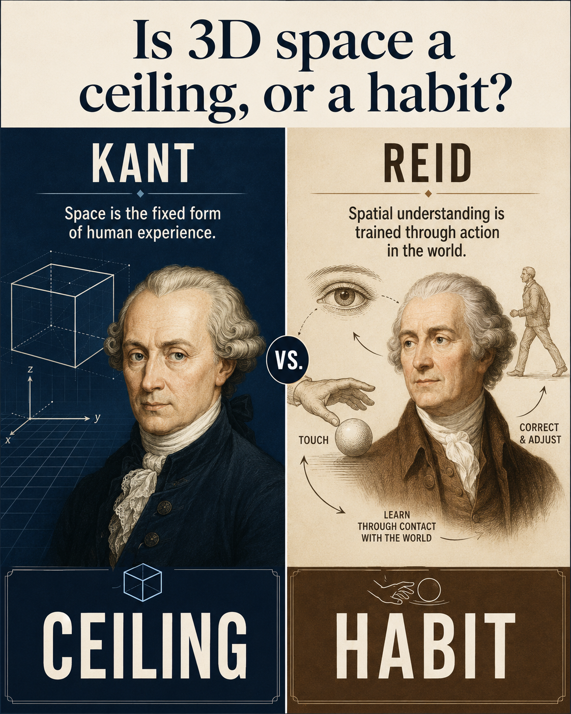
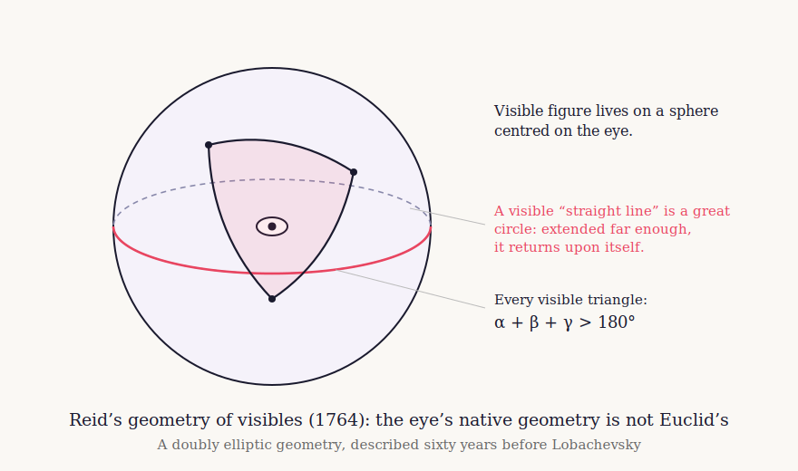
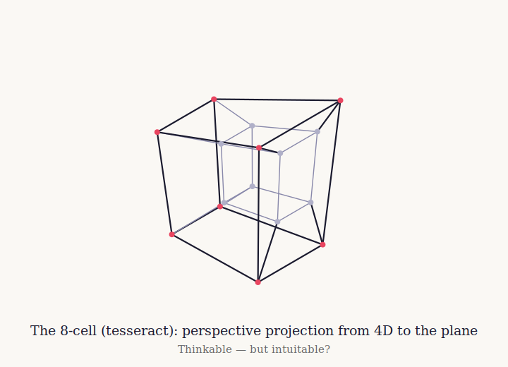
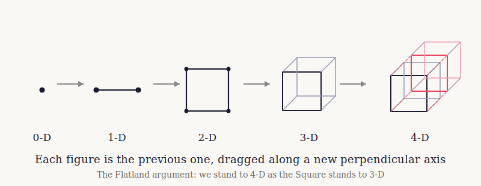
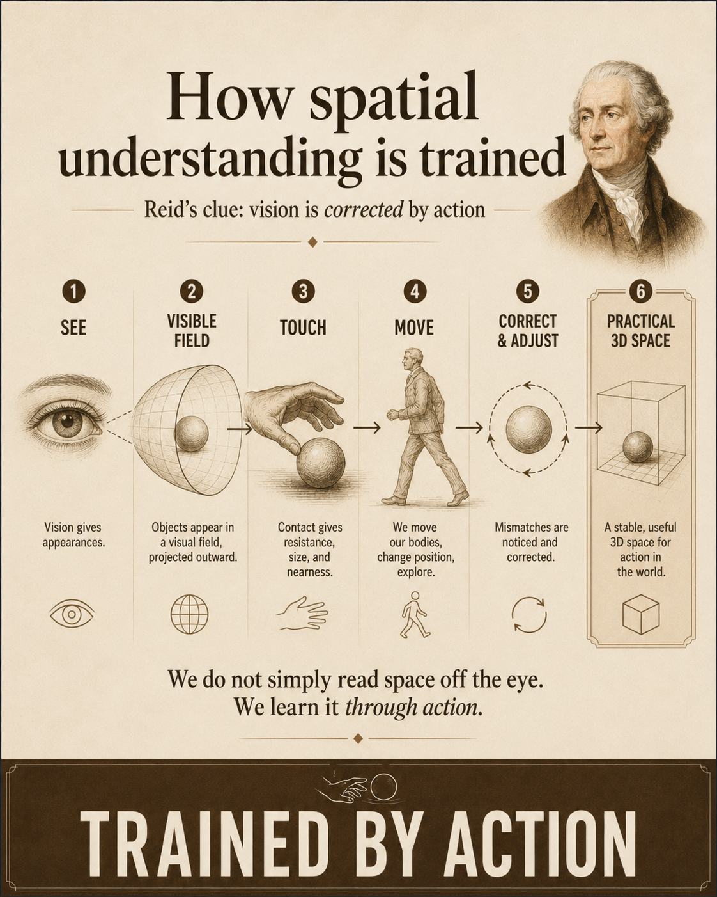
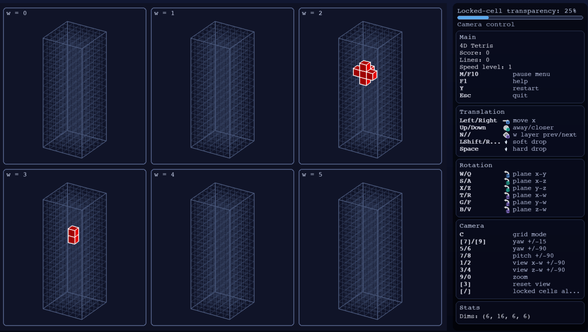
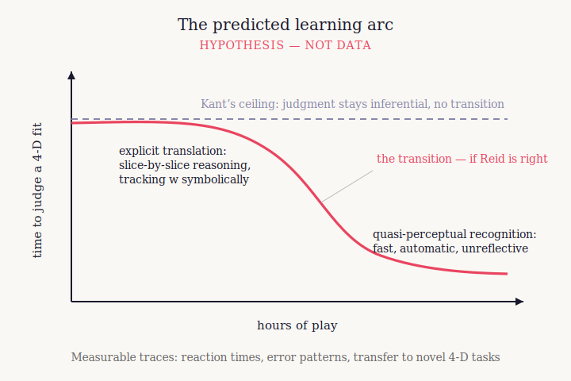

# Why a 4D Game? Reid, Kant, and the Question of Spatial Intuition

*Philosophical background for tet4d*

<!-- Figure 1: "Is 3D space a ceiling, or a habit?" -->

**The motivating question.** Is ordinary 3D spatial intuition a fixed ceiling, or a habit trained by structured action?

## The question

Is three-dimensional Euclidean space something the mind is *given*, or something the mind *builds*?

This sounds like an antiquarian dispute, but it has a live consequence. If Euclidean 3-space is the fixed, innate form
of all human spatial experience, then three dimensions are a ceiling. A fourth spatial dimension can be calculated with,
reasoned about, projected, sliced, and encoded — but never *seen*, never intuited, never inhabited.

If, instead, practical 3D spatial understanding is an achievement — stabilized through vision, touch, movement,
correction, and repeated action — then three dimensions are not simply a ceiling. They are a habit. A very deep habit,
laid down by a lifetime of experience in a 3D world, but a habit nonetheless. And habits, given the right kind of
structured experience, can sometimes be extended.

tet4d exists because this is not only a question to argue about. It is a question that can be turned into an artifact: a
structured higher-dimensional world in which a person must move, rotate, collide, fail, correct, and possibly learn.

The philosophical contrast behind the project has two names. The first is Immanuel Kant. The second, less famously, is
Thomas Reid.

## Kant: space as the mind's necessary form

In the Transcendental Aesthetic of the *Critique of Pure Reason* (1781/1787), Kant argues that space is not a property
of things in themselves, nor a relation we abstract from experience. Space is the *form of outer intuition*: the
structure under which anything can appear to us as outside us at all. Time, similarly, is not just another object or
container in the world. It is the form of inner sense, the condition under which appearances are ordered for us.

Kant’s solution to the problem of knowledge is one of the great intellectual moves in philosophy. He saw that experience
is not a passive imprint of the world upon the mind. The mind contributes form. It structures experience before any
particular object is known. This is the force of the synthetic a priori: some truths are not learned by observation, yet
are not empty definitions either. They are informative, necessary, and bound up with the conditions under which
experience becomes possible for us.

That is a clear, beautiful, invigorating, and revolutionary idea. Space and time, on Kant’s view, are not ordinary
things inside the world. They are the modes through which a world can appear to a human subject. The mind is not a
mirror held up to reality. It is an active condition of there being an ordered world-for-us in the first place.

The pressure point, for this project, is not Kant’s revolution. It is the stopping point of that revolution. Kant went
far enough to see that spatial experience is structured by the mind. But on the strong Euclidean reading, he did not go
far enough to ask whether that structuring might itself have a history, a plasticity, or a dependence on embodied
training.

Because the form of space is supplied prior to experience, the science of that form — geometry — consists, for Kant, of
synthetic a priori truths. And the geometry Kant had in view was Euclid’s. Space, for Kant, is necessarily Euclidean,
not as a discovered fact about the external world, but as a condition of human spatial experience.

The reading relevant to tet4d is the strong one: if Euclidean 3-space is the necessary form of human outer intuition,
then a fourth spatial dimension can be represented, calculated, and analogized, but not inhabited as ordinary space is
inhabited. Projections, slices, unfoldings, color-coded fourth coordinates, and algebraic models would all remain
translation devices. They might allow thought about 4D structure, but not direct spatial intuition of it.

That distinction matters. A person can manipulate symbols without spatially understanding what they mean. A person can
follow a projection without seeing the thing projected. A person can reason about a fourth coordinate while still
living, perceptually and practically, inside three dimensions.

Kant himself died in 1804, before the mature development of non-Euclidean geometry. So the claim here is not that Kant
personally confronted Lobachevsky, Bolyai, Riemann, or relativity and refused their implications. The point is narrower:
a strong Kantian reading makes ordinary Euclidean spatial intuition fixed in advance. On that reading, 4D intuition is
not a difficult human achievement. It is impossible.

## Reid: the geometry we are given is not Euclid’s

Thomas Reid’s *An Inquiry into the Human Mind on the Principles of Common Sense* appeared in 1764, seventeen years
before Kant’s *Critique of Pure Reason*. In chapter VI, section 9, Reid gives one of the strangest and most prescient
arguments in early modern philosophy: “the geometry of visibles.”

Reid asks a question with mathematical seriousness: what is the geometry of what the eye immediately presents?

Not what we eventually know about physical objects. Not the world as corrected by touch, locomotion, memory, and
judgment. Not the ordinary three-dimensional world of tables, chairs, roads, and rooms. Reid asks about visible figure
as such: the field of directions presented to sight before the other senses and the body’s movement have taught us how
to interpret it.

His answer is startling. The geometry of visibles is not ordinary Euclidean 3-space. It is more like the surface of a
sphere centered on the eye. In this geometry, a “straight” visible line behaves like a great circle. Extended far
enough, it returns upon itself. Two visible straight lines intersect twice. The angles of a visible triangle can sum to
more than two right angles.

**Reid’s geometry of visibles.** Immediate visible figure is modeled as a field of directions, not as ordinary Euclidean
depth-space.

This is not a casual metaphor. Reid is identifying a genuine geometry of a domain of experience. Long before the
nineteenth-century construction of non-Euclidean geometries, he describes a non-Euclidean structure and presents it not
as a formal curiosity, but as the geometry of immediate vision.

The next move is the crucial one.

If the eye’s immediate geometry is not ordinary Euclidean 3-space, where does our practical conviction of Euclidean
three-dimensional space come from?

Reid’s answer is not that the mind is blank and learns space from scratch. That would be too simple, and it would make
Reid into a crude empiricist. He is not one. Reid thinks the mind has original principles. Tangible extension, hardness,
resistance, and the body’s practical commerce with the world are not manufactured by abstract reasoning. The mind is
already structured.

But the unified practical space of ordinary life is not simply delivered whole by the eye. Vision gives signs. Touch,
movement, and correction teach us what those signs signify. We learn to correlate what is seen with what is handled,
approached, avoided, struck, grasped, and walked around.

This is why the Molyneux problem matters. Would a man born blind, who knew a cube and sphere by touch, recognize them by
sight immediately after gaining vision? Reid’s answer is no. The link between visible signs and tangible meanings has to
be learned. The visual field and the tangible world are not automatically one domain. They become coordinated.

So Reid’s position is subtle. He is not saying spatial structure is merely learned from experience in the old empiricist
sense. He is saying that the ordinary, unified, practical space we live in is an achievement of coordination between
originally structured senses, guided by movement and correction.

Euclidean 3-space, for Reid, is not simply the first thing given. It is the stabilized result.

## The inversion

The contrast with Kant is not a simple opposition between innate and learned. Both Kant and Reid think the mind is
structured. Both are responding, in different ways, to the crisis left by Hume. Both reject the idea that knowledge is
merely a pile of impressions.

The disagreement is deeper.

For the strong Kantian reading, Euclidean space is the given form of outer intuition. Non-Euclidean and
higher-dimensional spaces may be formally thinkable, but they are intellectual extensions beyond the fixed structure of
human spatial experience.

For Reid, the immediately given visual field is already not ordinary Euclidean 3-space. Practical Euclidean space is the
achievement. It is what emerges when vision, touch, self-motion, and correction are brought into stable coordination.

Put sharply:

- For Kant, ordinary Euclidean space is the starting point.
- For Reid, ordinary Euclidean space is the accomplishment.

That inversion is the philosophical heart of tet4d.

## Geometry after Kant

The nineteenth century put severe pressure on the strong Euclidean reading of Kant and made Reid’s side of the contrast
look unexpectedly modern.

Lobachevsky and Bolyai constructed consistent non-Euclidean geometries. Riemann generalized the idea of geometry to
spaces of arbitrary curvature and dimension. Helmholtz argued explicitly that the axioms of geometry are tied to
possible experience and to the behavior of bodies under movement. Poincaré later made the relation between geometry,
convention, and sensory-motor experience central to his philosophy of science.

The point is not that Reid caused this history. He did not. Nor is the point that modern geometry simply “refuted Kant”
in a schoolbook sense. Kant’s project is more complex than that, and later Kantian and neo-Kantian philosophers
developed more flexible interpretations.

The point is that the strong version of the Kantian claim became harder to maintain. If geometry can vary, if physical
space can be modeled non-Euclideanly, and if spatial understanding is tied to possible operations and measurements, then
the question of human spatial intuition begins to look less like a fixed metaphysical decree and more like a problem
about constitution, training, and embodied practice.

That is the line running from Reid through Helmholtz and Poincaré toward the modern question tet4d asks: what kinds of
spatial structure can a human being learn to handle directly?

## The fourth dimension as a training problem

The idea of training 4D intuition is not new.

Charles Howard Hinton spent the late nineteenth and early twentieth centuries designing exercises intended to cultivate
direct intuition of four-dimensional space. His colored-cube systems were not just illustrations. They were training
regimes. He believed that repeated disciplined work with lower-dimensional representations could help the mind acquire a
more immediate grasp of 4D structure. He also gave us the word “tesseract.”

**The tesseract.** A projection can be exact without becoming intuitive.

Edwin Abbott’s *Flatland* made the dimensional analogy culturally permanent. A two-dimensional creature cannot initially
understand “upward, not northward.” But the story’s force comes from the possibility that the limitation is not
absolute. The Square can be instructed. He can come to grasp, however imperfectly, that his world is a slice of a larger
one.

**The dimensional ladder.** Higher dimensions can be represented by analogy; the harder question is whether such
representation can become intuition.

These nineteenth-century and literary attempts matter because they define the problem. The issue is not whether 4D
geometry can be symbolized. Of course it can. The issue is whether symbol, projection, analogy, and repeated
manipulation can become something more like spatial intuition.

There is also modern experimental evidence that the question is not empty.

Aflalo and Graziano trained participants to path-integrate in a virtual 4D maze: after moving through a four-dimensional
environment, participants had to point back toward their starting location. Performance improved with practice and could
not be reduced simply to ordinary 3D shortcuts.

Ambinder, Wang, Crowell, Francis, and Brinkmann studied judgments of distances and angles between line segments embedded
in true 4D space and viewed in virtual reality. Their results suggested that participants were not merely responding to
the 3D projection. They were using information from the fourth dimension, though the representations were primitive and
short-lived.

Wang later extended this line of work to judgments of hypervolume.

This literature does not show that humans can acquire ordinary 4D perception. It does not show that a person can
experience four-dimensional space as effortlessly as the room around them. But it does show something important: human
spatial representation is not trivially hard-capped at three dimensions. There is room to ask what training, action,
feedback, and motivation might do.

## Spatial understanding as calibrated action

The key Reidian idea is not that seeing alone gives us space. It is that spatial understanding is stabilized through
action.

We see. We move. We touch. We fail. We correct. We learn that this visible sign predicts that tangible resistance; that
this apparent shape changes with movement; that this edge can be walked around; that this gap can be crossed; that this
object is behind that one; that this path returns to where we began.

Spatial competence is not passive visualization. It is calibrated action.

<!-- Figure 3: "How spatial understanding is trained" -->

**Spatial competence as calibration.** Vision, touch, movement, failure, and correction stabilize practical spatial
understanding.

This is where a game becomes philosophically serious.

A diagram can represent a structure. A proof can formalize it. A projection can encode it. But a game makes the
structure matter under action. You move. You rotate. You collide. You misjudge. You recover. You get faster. You stop
verbalizing. You begin to see what will happen before you can explain why.

That transition is familiar from ordinary spatial games. Nobody becomes good at Tetris by calculating every possible
placement from first principles. The player learns to see fit, gap, overhang, rotation, danger, and recovery. What
begins as conscious manipulation becomes practical perception.

tet4d asks whether anything like that transition can be pushed upward.

## What tet4d is for

tet4d began as a 2D/3D/4D Tetris-like game. That is still the entry point: falling pieces, higher-dimensional rotations,
projections, slices, occlusion, and the practical difficulty of placing a structure whose full shape is not available to
ordinary 3D intuition.

But the project is not merely “Tetris with one more coordinate.” Its real purpose is to turn higher-dimensional spatial
structure into repeated action.

The player is not asked only to admire a tesseract or understand an analogy. The player has to do something. Move the
piece. Rotate it. Read the slice. Predict the collision. Notice the hidden obstruction. Learn the topology of the board.
Correct the mistake. Try again.

The later movement of the project into topology exploration and 4D simulation is not a departure from the original
philosophical question. It extends it.

Topology asks how a space is connected: what counts as adjacent, where seams lead, whether an edge is really an edge,
whether a world wraps, folds, or glues back onto itself. Geometry asks about shape, metric, projection, and relative
structure. Simulation asks how structure reveals itself through motion, collision, conservation, failure, and trace.

All of these are ways of turning spatial form into something acted within rather than merely described.

<!-- Figure 5: tet4d gameplay or sandbox screenshot -->

**tet4d as artifact.** The project turns higher-dimensional structure into repeated action: move, rotate, collide,
place, fail, correct, and try again.

This is why a game is not a gimmick attached to a philosophical idea. It is the correct medium for the hypothesis. If
spatial intuition is trained through structured action, then a structured 4D action environment is exactly the kind of
artifact one would build.

## The learning hypothesis

The hypothesis is not mystical. It is not that players will suddenly “see 4D” in some undefined private sense.

The hypothesis is a transition in competence.

At first, a player must translate. The fourth coordinate is a symbol. Slices are diagrams. Movement through *w* is an
operation to remember. Mistakes are surprising because the player is still thinking in three-dimensional projections.

With practice, perhaps, some of that explicit translation may collapse into faster recognition. The player may begin to
judge fit without consciously tracking every coordinate. Errors may become more structured. Reaction times may fall.
Projection-only mistakes may decrease. Skills may transfer to unfamiliar 4D configurations. The player may begin to
experience certain 4D relations as immediate in the same way a practiced Tetris player immediately sees a 2D placement.

That is the Reidian bet in operational form.

**The tet4d hypothesis.** Repeated structured play may shift 4D judgment from explicit coordinate translation toward
faster, more automatic recognition. This is a hypothesis, not data.

A laboratory task can show that a particular 4D judgment is possible. A game asks a different question: what happens
after many hours of motivated, consequence-laden interaction, where the higher-dimensional structure is not the object
of an explicit test but the medium in which action takes place?

That is the experiment tet4d makes playable.

## What Tet4D Makes Possible

Tet4D does not need to prove Reid right or refute Kant. Its claim is sharper: it turns the question into a recursive
experiment.

Spatial intuition should not be treated as a fixed possession, something the mind either has or lacks. If we follow 
Reid, then we should see ordinary 3D Euclidean space as something built through loops of action, resistance, correction, 
prediction, and feedback. I have built Tet4D in the hope that the same process can be pushed one dimension higher.

At first, 4D play is translation. The player manages projections, symbols, slices, rotations, and rules. But repeated
interaction may change the status of those rules. Translation may become anticipation. Projection management may
become spatial expectation. Calculation may begin to behave like intuition.

Failure would still matter. If players improve only at symbolic manipulation, that tells us where the ceiling is. If
they transfer competence to unfamiliar 4D tasks, then the ceiling has moved.

That is the point of Tet4D: not to declare that higher-dimensional intuition is possible, but to give the claim a
playable form in which learning, failure, transfer, and transformation can actually be observed.

Tet4D is the argument in executable form: give the mind a lawful higher-dimensional world, give it action and
recurrence, and test whether the boundary between calculation and intuition holds.

The important move is that the question is not left as a slogan. It is given a form in which something can happen.
Players can learn or fail to learn. Errors can be observed. Strategies can change. Reaction times can be measured. New
tasks can test transfer. The difference between calculation and intuition can become a practical question rather than a
metaphysical declaration.

That is why tet4d belongs on the Reid side of the argument. Not because Reid has already won, and not because Kant was
foolish. Kant’s revolution was to see that the mind contributes structure to experience. Reid’s relevance here is to
suggest that the structure of practical spatial life may itself be coordinated, stabilized, and trained through embodied
action.

The issue is not whether the mind structures spatial experience.

## References and further reading

### Primary philosophical sources

- Reid, T. (1764). *An Inquiry into the Human Mind on the Principles of Common Sense*, especially chapter VI, section 9,
  “The geometry of visibles.”
  [Early Modern Texts](https://www.earlymoderntexts.com/authors/reid)

- Kant, I. (1781/1787). *Critique of Pure Reason*, especially the Transcendental Aesthetic.
  [Project Gutenberg: Meiklejohn translation](https://www.gutenberg.org/ebooks/4280)

- Kant, I. (1783). *Prolegomena to Any Future Metaphysics*.
  [Project Gutenberg](https://www.gutenberg.org/ebooks/52821)

- Riemann, B. (1854). “Über die Hypothesen, welche der Geometrie zu Grunde liegen” / “On the Hypotheses Which Lie at the
  Bases of Geometry.”

- Helmholtz, H. von (1870). “Über den Ursprung und die Bedeutung der geometrischen Axiome” / “On the Origin and
  Significance of the Axioms of Geometry.”

- Poincaré, H. (1902). *La Science et l’Hypothèse* / *Science and Hypothesis*, chapters 3–5.
  [Project Gutenberg](https://www.gutenberg.org/ebooks/37157)

### Four-dimensional imagination

- Abbott, E. A. (1884). *Flatland: A Romance of Many Dimensions*.
  [Project Gutenberg](https://www.gutenberg.org/ebooks/201)

- Hinton, C. H. (1888). *A New Era of Thought*. London: Swan Sonnenschein.

- Hinton, C. H. (1904). *The Fourth Dimension*.
  [Project Gutenberg](https://www.gutenberg.org/ebooks/60766)

### Modern experimental work

- Aflalo, T. N., & Graziano, M. S. A. (2008). “Four-dimensional spatial reasoning in humans.” *Journal of Experimental
  Psychology: Human Perception and Performance*, 34(5), 1066–1077.

- Ambinder, M. S., Wang, R. F., Crowell, J. A., Francis, G. K., & Brinkmann, P. (2009). “Human four-dimensional spatial
  intuition in virtual reality.” *Psychonomic Bulletin & Review*, 16(5), 818–823.
  [doi:10.3758/PBR.16.5.818](https://doi.org/10.3758/PBR.16.5.818)

- Wang, R. F. (2014). “Human four-dimensional spatial judgments of hyper-volume.” *Spatial Cognition & Computation*, 14(
  2), 91–113.

### Scholarship and background

- Daniels, N. (1974). *Thomas Reid’s Inquiry: The Geometry of Visibles and the Case for Realism*. New York: Burt
  Franklin.

- Van Cleve, J. (2002). “Thomas Reid’s geometry of visibles.” *The Philosophical Review*, 111(3), 373–416.

- Friedman, M. (1992). *Kant and the Exact Sciences*. Cambridge, MA: Harvard University Press.

- Wolterstorff, N. (2001). *Thomas Reid and the Story of Epistemology*. Cambridge University Press.

- Stanford Encyclopedia of Philosophy:
    - [Thomas Reid](https://plato.stanford.edu/entries/reid/)
    - [Kant’s Views on Space and Time](https://plato.stanford.edu/entries/kant-spacetime/)
    - [The Molyneux Problem](https://plato.stanford.edu/entries/molyneux-problem/)
    - [Nineteenth Century Geometry](https://plato.stanford.edu/entries/geometry-19th/)
