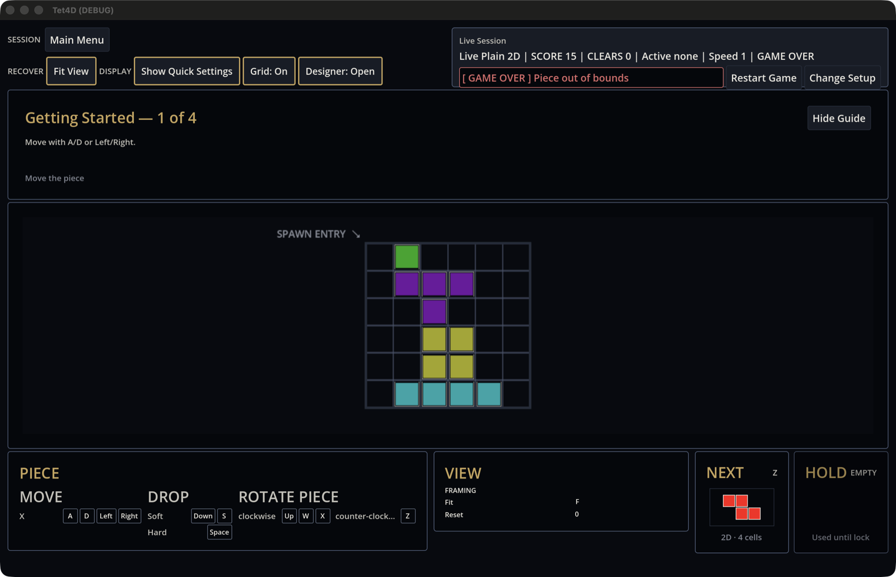
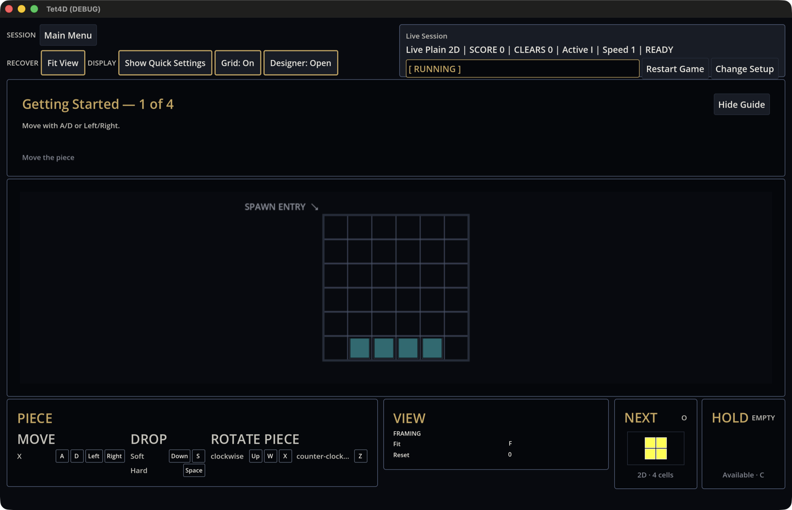
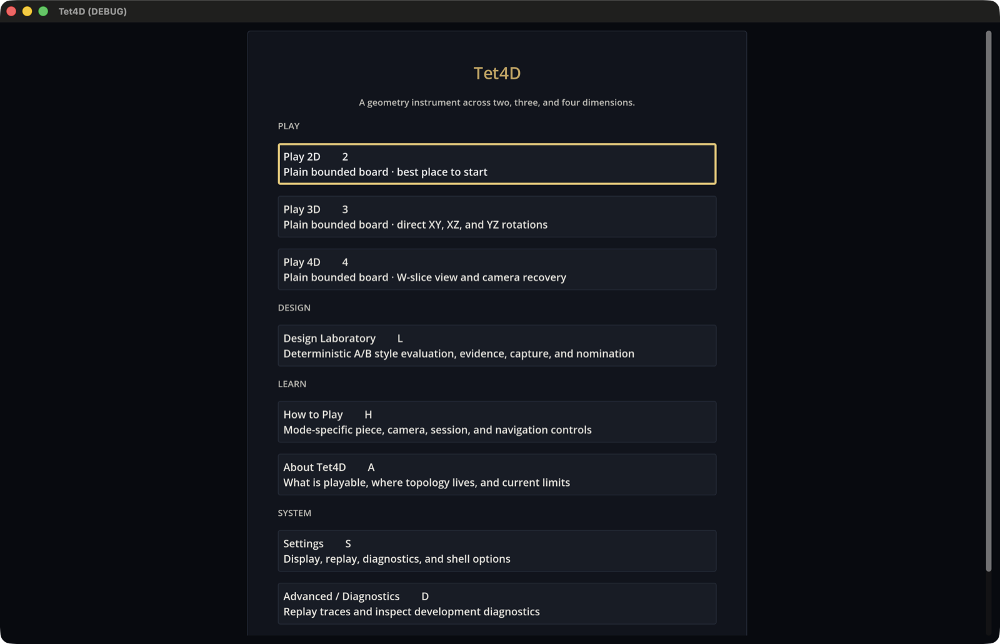
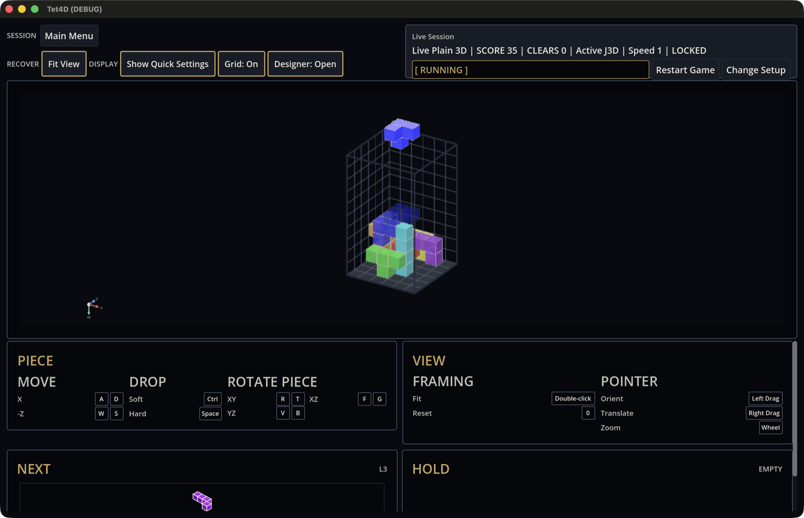
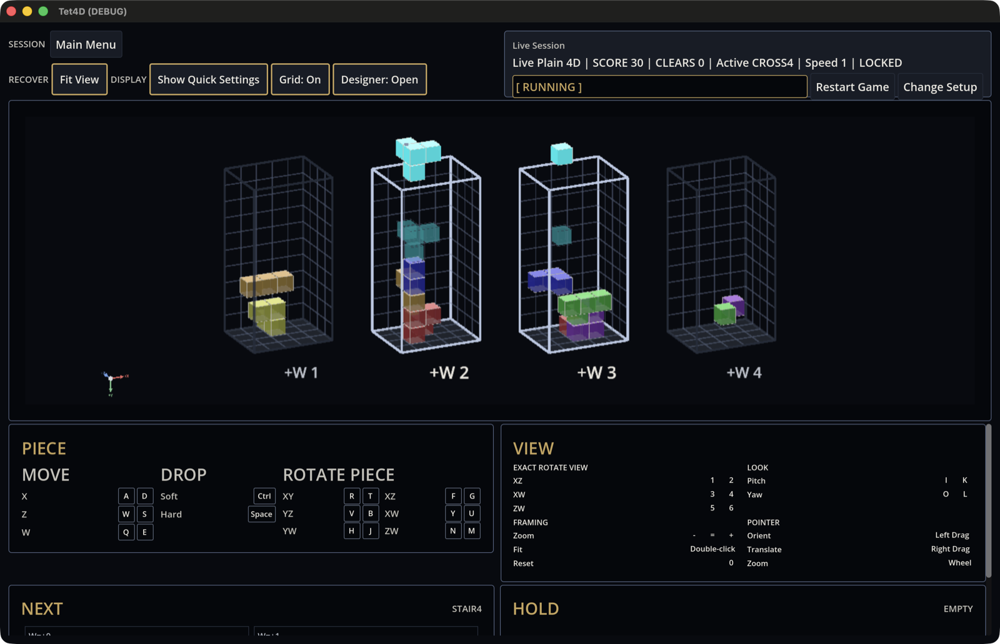
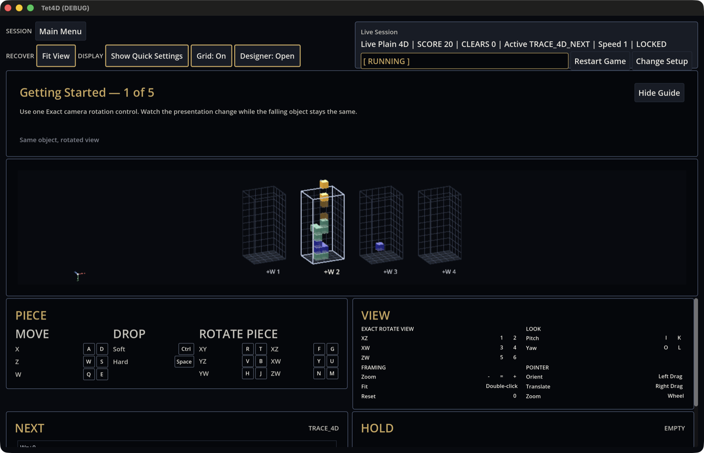

# Stage 56H playability pre-review (agent playtest)

An agent played the Godot game build on 2026-09-25 and recorded what it found.
This is input to Stage 56H, not the Stage 56H human playability acceptance. It
changes no acceptance criterion, and the 190/200 human A/B choice stays open.
Part 1 checks whether the game plays correctly over a session. Part 2 judges
whether it is pleasant to look at and to play. The recommendations are
proposals for the product owner.

## Setup

- Build: branch `claude/fix-4d-pan-under-reflection` at `cf7aec4f`, with the
  native GDExtension rebuilt from that checkout. The branch fast-forwarded to
  `8328b827` mid-session, but `godot/` and `native/` are identical in both.
- Godot 4.7.2 on macOS, Apple M1 Pro, 2× Retina display.
- Game product entry:
  `godot --path godot/Tet4D.Godot res://scenes/game_bootstrap.tscn`.
- Every launch used a fresh throwaway `HOME` and `XDG_*`, so each run was a
  first run with no persisted profile.
- The window was resized to a 1440×900-point client, the Stage 56G `standard`
  size. Input was real macOS keyboard and mouse events.

## Part 1: does it play correctly over a session?

"Played" means the finding was reproduced in the running game. "Code" means it
was established from source only.

### 1. Quick entry paths run a fixture session (played)

The game build boots straight into Live 2D
(`godot/Tet4D.Godot/scripts/app/trace_replay_app.gd:160`). Tab moves to Live 3D and then Live 4D
(`:351`, `:399`), and neither goes through setup. The native default session
does not shuffle. In 4D it repeats a fixed cycle of trace fixtures
(`native/tet4d_core/src/core/plain_piece_catalog.cpp:111`): a domino, STAIR4, a
4-cell `TRACE_4D`, a 1-cell `TRACE_4D`, and `TRACE_4D_NEXT`, which is two cubes
with a gap between them. Every piece spawned in slice W2 (capture 06).

The unconfigured 2D session fell at about 0.5 s per row while the HUD said
"Speed 1". A 4D game started from Main Menu → Play 4D → Start fell at the tuned
1.7 s and used the real piece set (CORK4, FORK4, CROSS4, and so on). A fresh
launch reached GAME OVER about 40 s after start with no input at all
(capture 01).

### 2. NEXT and HOLD are below the fold at 1440×900 (played)

In a set-up 4D game, NEXT and HOLD were completely off-screen, with or without
the tutorial panel. About 20 scroll ticks on the deck brought them into view,
and the NEXT thumbnails were about 25 px tall. In 3D and in the Tab-path 4D
session, the NEXT heading was visible but its thumbnail was cut off
(captures 05 and 06). Before the Stage 56 cockpit, NEXT and HOLD sat beside the
board (see `screenshots/built_in_style_catalog/`). Criterion 2 of
`docs/tasks/live_4d_cockpit_convergence.md` fixes the
`PIECE | VIEW | PIECE STATE` order, so changing this is a contract decision.

### 3. Holding soft drop on the floor stops locking (played)

With the piece on the floor, S was held for 6 s. The piece stayed active, and
it locked on the tick after release. Each soft-drop repeat resets the gravity
accumulator (`godot/Tet4D.Godot/scripts/app/trace_replay_app.gd:1665`).

### 4. Moving a grounded piece does not extend the lock (played)

A grounded O locked while A/D were being tapped every 0.15 s. The next gravity
tick locks a grounded piece
(`native/tet4d_core/src/core/plain_nd_session.cpp:431`), with no lock delay and
no move reset. At 4D speed 5 that leaves 340 ms to finish an adjustment.

### 5. Speed never increases during a game (code)

The gravity interval is assigned once, at game start
(`godot/Tet4D.Godot/scripts/app/trace_replay_app.gd:1458`). The curve `base_ms / level` halves
the interval from level 1 to 2, but changes it by only about 10% from level 9
to 10.

### 6. Restart is one unconfirmed key that differs by mode (played)

In 2D, R restarted instantly (`godot/Tet4D.Godot/scripts/app/trace_replay_app.gd:356`). In 4D, R
rotated the piece in XY and Backspace restarted instantly (`:471`). Neither
asks for confirmation.

### 7. Ctrl soft drop collides with macOS desktop switching (played)

In 3D and 4D the arrow keys also move the piece, and soft drop is Ctrl.
Ctrl+→ switched the macOS desktop Space and never reached the game; the piece
did not move.

### 8. The game keeps running when it loses focus (played)

While the window was on another Space for about 14 s, the active piece fell
about 8 rows. No focus-loss pause exists in `godot/Tet4D.Godot/scripts/`.

### 9. The README from-source command launches the Designer (played)

`godot --path godot/Tet4D.Godot` opens `trace_replay.tscn`, whose `product_id`
defaults to `godot_designer`. That build opens on the Main Menu, and Design
Laboratory works there. In the game build the same Main Menu card highlights
and does nothing: it is created unconditionally
(`godot/Tet4D.Godot/scripts/ui/replay_hud.gd:2602`) but connected only for the Designer
(`godot/Tet4D.Godot/scripts/app/trace_replay_app.gd:708`).

### 10. The 4D tutorial teaches the camera, and gravity runs under it (played)

4D tutorial step 1 of 5 is "Use one Exact camera rotation control". All five
4D steps are view exercises (`godot/Tet4D.Godot/scripts/ui/onboarding/live_onboarding_model.gd:17`).
Pieces keep falling while the tutorial is on screen; the first-launch game over
happened while it still said "Move the piece".

### 11. The default 2D board is 6×6 (played)

This is the setup default (`godot/Tet4D.Godot/scripts/ui/game_setup/game_setup_spec.gd:24`) and
the unconfigured size. The setup spec marks it as an accepted default, so it is
recorded here as a question rather than a defect.

### 12. The status badge says "[ RUNNING ]" while paused (played, new)

In 2D the piece stayed frozen for more than 2 s under a RUNNING badge
(captures 02 and 06). The likely cause is that pausing refreshes the HUD but
not the cached snapshot, whose `paused` flag the badge reads. That flag is
copied only on snapshot refresh (`godot/Tet4D.Godot/scripts/app/trace_replay_app.gd:2088`).

### 13. Every default game has the same piece order (played, new)

The setup default is a fixed seed of 1337
(`godot/Tet4D.Godot/scripts/ui/game_setup/game_setup_model.gd:267`). After a restart, CORK4 came
first again.

### 14. The default window is below the supported floor on Retina (played, new)

`project.godot` requests a 1600×960 viewport. On a 2× display the window opens
at 800×480 points, which is shorter than the 680×520 live-shell floor, and the
header was visibly clipped on first launch.

### Not verified

- **Esc from 4D.** Esc never reached the game while the automation overlay was
  active. Nothing in the input code blocks it, so it is untested, not a defect.
- **Long sessions.** No layers were cleared at high speed.
- **Feel at play speed.** How it feels in the hands still needs the human
  playtest.

## Part 2: is it nice to look at and nice to play?

**Verdict.** The board rendering is careful and tasteful, and it fits the
"calm geometry instrument" direction in `docs/design/godot_visual_system.md`.
The product around it does not yet look or feel like a game someone would play
for fun. Three things hold it back: the board is a small part of the screen,
nothing reacts when something happens, and the first minute is spent on
explanation and debug vocabulary.

### What works

- **The cubes.** Pastel cubes with light edge outlines inside wireframe boxes
  read cleanly, with grid lines kept to the rear faces. Close up, the 4D slices
  look like a neat technical illustration (capture 05).
- **Clear reading aids.** The landing ghost is readable. The frames on the
  active slices make it clear which W layers the piece occupies.
- **A coherent palette.** Near-black backgrounds and one muted gold accent are
  consistent across the screens.
- **A strong alternative style.** Tron Grid Flow, with its receding floor grid
  and cyan chrome, has real atmosphere (`screenshots/built_in_style_catalog/`).

### What holds it back

1. **The board is not the main visual object.** At 1440×900 with the tutorial
   showing, the 2D board is about 266×266 points, roughly 5% of the window.
   With the tutorial hidden, the 3D board is about 170×245 points, roughly 3%.
   The play area is wide and short, so tall boards are height-limited and
   leave most of the width empty. The header, tutorial panel, and key tables
   take most of the screen. Their gold-bordered buttons and large gold headings
   (PIECE, VIEW, NEXT, HOLD) are the brightest elements on screen and compete
   with the board. The visual authority says the chrome should not do this.

2. **Nothing moves or makes a sound.** The project has no audio at all.
   - Pieces jump from cell to cell. The renderer's only interpolation is for
     replay particles (`godot/Tet4D.Godot/scripts/rendering/trace_scene_renderer.gd:358`).
   - A line clear is instant, with no flash, collapse, or sound. The only sign
     is the CLEARS number changing.
   - A hard drop has no impact.
   - At game over the board freezes, and a small red badge appears in the
     header.
   - There are no score popups and no level-ups.

   Calm does not have to mean lifeless; feedback can be short and restrained.

3. **Depth is hard to read in 3D and 4D.**
   - Locked cells are see-through, so colours in a stack bleed into each other
     and the stack looks muddy (capture 04).
   - Flat, unlit cubes give little sense of which block is in front.
   - A 4D piece that spans slices shows up as separate fragments with nothing
     linking them. CROSS4 appeared as three cubes in W2 and one in W3.

4. **The text is written for developers, not players.**
   - The status line is a pipe-separated log: "Live Plain 2D | SCORE 15 |
     CLEARS 0 | Active none | Speed 1 | GAME OVER".
   - The status word shows engine command names such as TICK, LOCKED, and
     SOFT DROP.
   - Piece names include fixtures such as `TRACE_4D_NEXT`.
   - SCORE gets no more emphasis than any other field.
   - "SPAWN ENTRY ↘" floats beside the 2D board, and one key label is
     truncated ("counter-clock…").
   - "Show Quick Settings" opens no settings panel. It adds detail to the status
     line, which then overflows ("… | Clas…").
   - "Designer: Open" opens a Live Presentation Designer (A/B capture, profile
     library, factory defaults), which is an authoring tool.

5. **The first minute is a poor introduction.**
   - The game build opens on a running 6×6 game that ends itself.
   - The Designer build opens on a plain list of text cards under a small
     "Tet4D" title, with the subtitle "A geometry instrument across two, three,
     and four dimensions" (capture 03).
   - There is no logo, no art, and no moving preview.
   - Design Laboratory and Advanced / Diagnostics sit beside Play on the
     player's menu.

6. **Styles are hard to reach and most differ only slightly.** Six built-in
   styles ship, and the only way to change style is through the Designer
   authoring panel. Arcade Neon differs from the default mainly by a lighter
   backdrop. The default is the most austere of the six.

### Recommendations (owner decisions)

1. **Make the board the main visual object.** Put NEXT and HOLD beside the
   board, turn the key reference into an on-demand overlay (for example on H
   or "?"), and quiet the header. A target of at least 40% of the window for
   the board is a reasonable start.
2. **Add restrained feedback.** A short line-clear flash and collapse
   (150–250 ms), a subtle hard-drop impact, a lock flash, and a game-over card
   over the board showing the score and how to restart. All of it should
   respect Reduced Motion.
3. **Add a small sound set.** Move, rotate, lock, clear, and game-over sounds,
   with a mute toggle.
4. **Write player-facing status text.** Show the score prominently, drop engine
   vocabulary, and hide or rename fixture names.
5. **Build a front door.** A title screen with a slowly turning 4D piece, or an
   attract mode that plays the existing replay traces. In the game build, move
   Design Laboratory and Diagnostics behind Settings.
6. **Strengthen depth cues.** Make locked cells opaque or more opaque by
   default, add soft lighting or ambient occlusion, and give a piece's
   fragments across slices a shared outline or pulse.
7. **Smooth piece motion.** A 60–80 ms interpolation for moves and rotations,
   kept presentation-only as `godot/AGENTS.md` requires.

None of these calls for glow, repeated bright borders, or extra accent colours.
They stay within the restraint the visual authority asks for.

## Evidence captures

Real-window captures at a 1440×900-point client, downscaled to 1600 px wide.

1. First launch of the game build: GAME OVER with no input, the tutorial still
   on step 1, and a small board.
   
2. Paused immediately after a restart. The badge still says RUNNING.
   
3. Main Menu, as reached from the game build.
   
4. Set-up 3D mid-game with the tutorial hidden: a small board and see-through
   locked cells.
   
5. Set-up 4D mid-game, with the NEXT thumbnails cut off.
   
6. 4D reached with Tab: `TRACE_4D_NEXT` active, paused, and the badge still
   says RUNNING.
   

## Limits of this review

The playtest was short, and the tester is an agent. The aesthetic judgments
come from screenshots and brief sessions, and no audio could be judged because
the project has none. This record does not replace the human long-play,
key-legibility, and HOLD/NEXT emphasis checks that Stage 56H owns.
